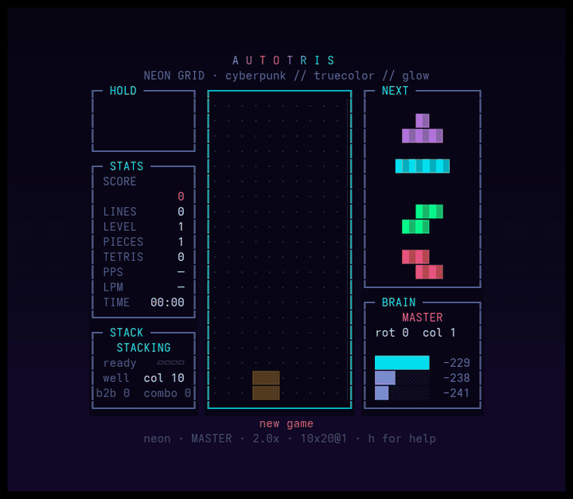

<div align="center">

# autotris

**A tetris that plays itself, built to live on the monitor you are not working on.**

No dependencies. No install step. No config file. Just Python 3 and a terminal.

[](https://www.python.org/)
[](#install)
[](#themes)
[](LICENSE)



</div>

## Install

```bash
git clone https://github.com/Utzig26/autotris
cd autotris
python3 -m autotris
```

That is the whole installation: the standard library and nothing else.

> Needs Python 3.10+ and a terminal with truecolor (ghostty, kitty, alacritty,
> foot, wezterm, iTerm2, Windows Terminal). Pass `--ascii` if your terminal has
> no unicode block glyphs.

## Quick start

```bash
python3 -m autotris                     # cycles through every theme
python3 -m autotris -t tokyo-night      # pick one
python3 -m autotris -t system           # match your desktop theme, live
python3 -m autotris -z -F               # zen: no HUD, board fills the window
```

Press `h` at any time for the controls.

The setup I actually leave running on the second screen:

```bash
python3 -m autotris -z -F -t system -s 1.5
```

## The second-monitor problem

I have two monitors. The second one is supposed to hold documentation.

In practice the second monitor is where my attention goes to die. Slack is
there. A dashboard nobody reads is there. A YouTube tab I paused four hours ago
is there, waiting, judging me. Every one of those things wants something from
me — a reply, a decision, an opinion about a thumbnail.

This is the opposite of that. It moves, it never finishes, it never asks for
anything, and you cannot interact with it. You glance over, some blocks fall, a
row explodes, you go back to work. It is a lava lamp that happens to be good at
tetris.

If you have ADHD you already know the difference between *stimulation* and
*demand*. A notification is a demand. A fish tank is stimulation. This is a fish
tank. The fish are very good at stacking.

> It also never dies, which turns out to matter. An early version played
> greedily, cleared single rows forever, and eventually topped out. Watching it
> fail was stressful in exactly the way a second monitor should not be. So the
> AI got rebuilt until it stopped dying.

## Controls

| key | what it does |
|-----|--------------|
| `h` `?` | show / hide the controls |
| `z` | zen mode — hide the entire HUD |
| `t` `T` | next / previous theme |
| `c` | toggle the theme auto-cycle |
| `o` | follow your desktop theme, live |
| `i` `I` | AI level up / down |
| `[` `]` | speed, 0.2x to 4x |
| `+` `-` | block size |
| `← →` | fewer / more columns |
| `↑ ↓` | more / fewer rows |
| `f` | fill the window with board |
| `g` | back to a normal 10×20 board |
| `r` | restart |
| `p` | pause |
| `q` | quit |

Block size defaults to the largest that fits your window, and re-fits when you
resize the terminal.

## The board is not fixed

Standard tetris is 10×20. This one runs anywhere from 5×8 to 80×50, resizable
live with the arrow keys. `f` sizes the board to your window. The stack and your
score survive the resize — the board grows around what is already there.

Wide boards change the game completely. At 10 columns a row takes about two and
a half pieces; at 40 columns it takes ten, so rows resolve slowly and the AI
spends its time building one very long, very flat surface. It is substantially
calmer to watch. And the AI plays *better* there, because there is more room to
keep the stack clean:

| board | holes left behind | lines cleared as tetris |
|-------|------------------|-------------------------|
| 10×20 | 0.12 | 87% |
| 16×24 | 0.00 | 100% |
| 40×40 | 0.00 | 100% |

## The AI

Five levels, cycled with `i`:

| level | behaviour |
|-------|-----------|
| `CHAOS` | drops pieces anywhere, dies fast |
| `ROOKIE` | misses about half of its moves |
| `PLAIN` | classic El-Tetris — plays clean, clears one row at a time |
| `STACKER` | reserves a well, stacks, only cashes out four rows at a time |
| `MASTER` | STACKER, reading the next piece too *(default)* |

STACKER and MASTER reserve one column as a well, stack the other nine, and wait
for a vertical I — but they never abandon a buried hole. Four modes, shown live
in the STACK panel:

- **STACKING** — clean base, saving everything for a tetris, refusing 1–3 row clears
- **DIGGING** — a hole got buried: clear normal rows until it is dug out, then resume
- **PANIC** — stack got too high: clear anything until it comes back down
- the well migrates to another column on its own if it gets covered

Measured over 1000 pieces: **87% of all cleared lines come out as tetrises, an
average of 0.12 buried holes, and it does not die.**

Getting there took a few rounds of being wrong:

| version | holes (avg) | worst | lines as tetris |
|---------|------------|-------|-----------------|
| plain El-Tetris | 0.1 | 4 | 0% |
| first stacker | 2.08 | 16 | 70% |
| **with DIGGING** | **0.12** | **8** | **87%** |

The first stacker chased tetrises so hard it would bury a hole and never come
back for it — the board slowly filled with dead space. Adding the digging mode
fixed the holes *and* raised the tetris rate, because a clean base is what makes
the well work in the first place.

Every heuristic runs on bitmasks, one integer per row, which is what makes a
huge board affordable at all:

| board | before bitboards | after | speedup |
|-------|-----------------|-------|---------|
| 10×20 | 38 ms | 7 ms | 5× |
| 40×40 | 483 ms | 33 ms | 15× |
| 80×50 | 2182 ms | 82 ms | **27×** |

The BRAIN panel shows the chosen move and the scores of the top three
candidates, so you can watch it think.

## Themes

**7 built-in**

| theme | look |
|-------|------|
| `neon` | cyberpunk, bevelled blocks, dotted grid |
| `arcade` | NES 1989, flat colour on pure black |
| `crt` | amber phosphor, scanlines, flicker |
| `kawaii` | pastel, the live piece has a face, heart particles |
| `matrix` | katakana rain, blocks made of glyphs |
| `vapor` | pink/purple gradient with a striped sun |
| `steampunk` | brass and copper, turning gears, rising steam |

**Plus every theme you have installed in [Omarchy](https://omarchy.org)**, read
straight from each `colors.toml`. The seven pieces take the terminal palette,
the UI takes accent/background/foreground, and light themes invert the block
shading automatically.

```bash
python3 -m autotris -t gruvbox
python3 -m autotris --list        # everything available on your machine
```

`-t system` (or the `o` key) uses whatever theme your desktop is on **right
now** — and keeps watching. Switch your Omarchy theme and the game follows,
mid-animation.

With no `-t` it cycles through all of them, using one of eight randomly picked
transitions: wipe, iris, dissolve, falling blocks, curtain, doors, glitch, scan.

## Effects

Ghost piece · vertical trails on hard drop · white flash and dust on lock · line
clears in three beats (flash → wipe from the centre out → collapse) · shockwave
and full-screen flash on a tetris · the frame pulsing red when the stack gets
dangerous · a game over that dissolves the stack from the bottom up and restarts
itself · a different living background per theme.

Costs about 5% of one core at 30fps.

## Options

```
-t, --theme     starting theme (built-in, an omarchy name, or 'system')
-g, --gallery   seconds per theme in the gallery (default 25)
-s, --speed     speed multiplier
-i, --iq        AI level, 0-4
-S, --scale     block size (0 = biggest that fits)
-G, --grid      board size, e.g. 20x24
-F, --fill      board as large as the window, follows resizes
-z, --zen       start with the HUD hidden
    --only      builtin | omarchy | all
    --ascii     ASCII fallback for terminals without unicode
    --list      list every theme
```

## Project layout

| package | what is in it |
|---------|--------------|
| `core/` | board, pieces, scoring and the game state machine — emits events, draws nothing |
| `ai/` | the brain: bitboard heuristics, an `Evaluator` and a `Strategy` per level |
| `display/` | the cell canvas, colour maths and terminal ownership |
| `theming/` | themes, block styles, animated backdrops, Omarchy loading |
| `view/` | widgets: panels, board, overlays, transitions, effects |
| `input/` | key decoding and one command per binding |
| `tools/record.py` | renders the demo gif without involving a terminal |

## License

[MIT](LICENSE) — do whatever you want with it.
